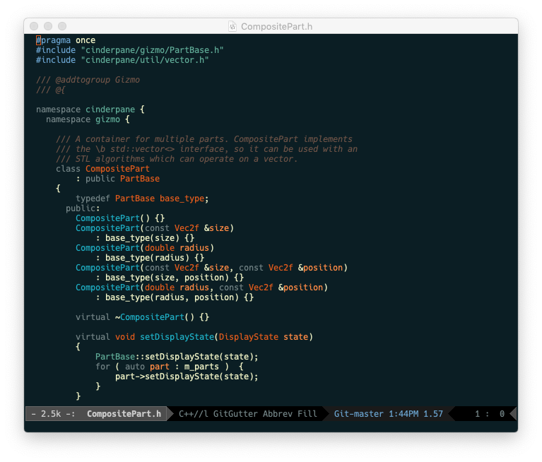

# Spacedust

An Emacs port of the
[hallski/spacedust](https://github.com/hallski/spacedust-theme) color
theme.

### Screenshot



## Installation

### Manually

Download [spacedust-theme.el](spacedust-theme.el) to a directory in
your load-path, then put the following in your Emacs configuration
file:

```
(load-theme 'spacedust t)
```
